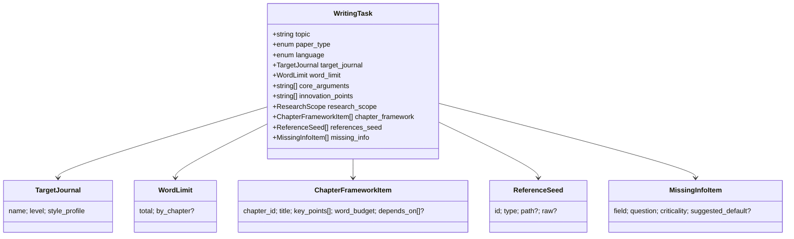

# 03 · 统一输入输出字段规范

> 跨 6 个 Skill 的契约层。任何修改都必须同步 `schemas/*.schema.json` 与
> `skills/_shared/schemas.py`，并在群里通知所有成员。

## 一、顶层 state

[`schemas/state.schema.json`](../schemas/state.schema.json) 描述了
`.writeagent/state.json` 的完整结构：

```jsonc
{
  "case_id":        "string",            // 案例 id
  "user_request":   "string",            // 用户原始自然语言需求
  "stage":          "enum",              // init / skill1_running / skill1_done / ... / finished / failed
  "history":        [HistoryEntry, ...], // 跨 Skill 的运行日志
  "intermediate":   { ... },             // Sub-agent 结构化中间结果
  "writing_task":   { ... },             // Skill 1 输出
  "literature_report": { ... },          // Skill 2 输出
  "outline":        { ... },             // Skill 3 输出
  "draft":          { ... },             // Skill 4 输出
  "formatted_draft":{ ... },             // Skill 5 输出
  "polished_draft": { ... }              // Skill 6 输出
}
```

`HistoryEntry`：

```json
{ "skill": "skill-id", "ts": "ISO8601", "status": "ok|error|skipped", "message": "...", "duration_ms": 123 }
```

## 二、`intermediate`：Sub-agent 中间产物

`intermediate` 是 Main Agent、动态 Sub-agent 与 Skill script 的交接区。Main Agent 不直接写专业产物；Sub-agent 只能写 `state.intermediate.*`；Skill script 读取 intermediate 后执行校验、增强、渲染和正式字段写入。

示例：

```jsonc
{
  "intermediate": {
    "requirement": {
      "raw_writing_task": {}
    },
    "literature_review": {
      "paper_claims": [],
      "synthesis": {}
    },
    "outline": {
      "raw_outline": {}
    }
  }
}
```

写入规则：

- Main Agent：可以写 `last_runner`、`last_status` 等少量运行状态；不直接写 `writing_task`、`literature_report`、`outline`、`draft`、`formatted_draft`、`polished_draft`。
- Sub-agent：只能写 `state.intermediate.*`，不能写正式产物字段，不能直接写 outputs 文件。
- Skill script：负责读取对应 intermediate，执行 schema validation、确定性处理、Markdown render，并写正式产物字段。
- LLM 调用：只允许在 `agent/llm_gateway.py` 经过 Main Agent 或 Sub-agent 发生；Skill script 禁止直接调用 LLM。

## 三、Skill 1 → Skill 2：`writing_task`

完整 schema：[`schemas/writing_task.schema.json`](../schemas/writing_task.schema.json)
完整字段说明：[`skills/writing-requirement-analysis/references/task-book-fields.md`](../skills/writing-requirement-analysis/references/task-book-fields.md)



下游 Skill 2 必须读取的字段：
- `topic`, `paper_type`, `language`, `target_journal.style_profile.citation_style`
- `core_arguments[]`（用于 `alignment_to_core`）
- `references_seed[]`（当用户没显式传 `--refs/--pdf-dir/--text-file` 时使用）

## 四、Skill 2 → Skill 3：`literature_report`

完整 schema：[`schemas/literature_report.schema.json`](../schemas/literature_report.schema.json)

```jsonc
{
  "keywords":    ["..."],
  "papers":      [PaperRecord, ...],
  "research_landscape": {
    "clusters":         [{ "name", "summary", "paper_ids[]" }],
    "timeline_summary": "..."
  },
  "consensus":         ["..."],
  "controversies":     ["..."],
  "research_gaps":     ["..."],
  "citation_style":    "GB/T 7714 | APA | IEEE | ACM | Chicago",
  "formatted_bibliography": { "gb7714": ["..."], "apa": ["..."] }
}
```

`PaperRecord`：

```jsonc
{
  "id": "stable-key",
  "type": "journal | conference | preprint | book | thesis | report | misc",
  "title": "...",
  "authors": ["..."],
  "year": 2024,
  "venue": "...",
  "doi": "...",
  "url": "...",
  "abstract": "...",
  "key_claims": ["..."],
  "evidence_strength": "strong | moderate | weak | anecdotal",
  "alignment_to_core": [
    { "core_argument_index": 0, "stance": "supports | extends | challenges | neutral", "note": "..." }
  ],
  "source_kind": "bibtex | pdf | text | url"
}
```

下游 Skill 3 / Skill 4 关心：
- `papers[].id` 作为引用 id；
- `papers[].alignment_to_core` 决定哪些文献支撑哪个论点；
- `research_landscape.clusters` 用作综述类章节的素材；
- `consensus / controversies / research_gaps` 用于"相关工作"、"讨论"段落。

## 五、Skill 3 → Skill 4：`outline`

完整 schema：[`schemas/paper_outline.schema.json`](../schemas/paper_outline.schema.json)

```jsonc
{
  "total_word_budget": 10000,
  "sections": [
    {
      "id":               "1",
      "title":            "引言",
      "level":            1,
      "parent_id":        null,
      "key_points":       ["...", "..."],
      "transition_note":  "...",
      "word_budget":      800,
      "supporting_papers":["yao2022react", "wang2024agentsurvey"]
    },
    { "id": "1.1", "level": 2, "parent_id": "1", ... }
  ]
}
```

**约束**：
- `level ∈ {1, 2, 3}`（4 级仅在 >12000 字时启用）。
- 字数预算之和 ≈ `total_word_budget`（±5%）。
- 每个非"摘要/结论"节至少绑定 1 篇支撑文献。

## 六、Skill 4 → Skill 5：`draft`

完整 schema：[`schemas/paper_draft.schema.json`](../schemas/paper_draft.schema.json)

```jsonc
{
  "abstract": "...",
  "keywords": ["...", "..."],
  "sections": [
    {
      "id":                "1",
      "title":             "引言",
      "content_markdown":  "...含 [1] [2] 风格的内联引用...",
      "citations_used":    ["yao2022react", "wang2024agentsurvey"],
      "word_count":        780
    }
  ],
  "open_questions": ["..."]
}
```

**约束**：
- `sections[].id` 顺序与编号必须与 `outline.sections.id` 一致。
- 引用 id 必须存在于 `literature_report.papers.id`。
- 摘要单独保存，不重复到 sections 里。

## 七、Skill 5 → Skill 6：`formatted_draft`

完整 schema：[`schemas/format_report.schema.json`](../schemas/format_report.schema.json)

```jsonc
{
  "normalized_draft": {
    "abstract": "...",
    "sections": [ ... ]                  // 结构同 draft.sections，但内容已格式标准化
  },
  "export_paths": {
    "markdown": "outputs/05-format.md",
    "docx":     "outputs/05-format.docx",
    "pdf":      "outputs/05-format.pdf"
  },
  "issues": [
    {
      "category":   "heading | font | spacing | figure | table | citation | bibliography | other",
      "location":   "section 2.1 / 表 3 / ...",
      "severity":   "error | warning | info",
      "message":    "...",
      "suggestion": "..."
    }
  ]
}
```

## 八、Skill 6：`polished_draft`

完整 schema：[`schemas/polish_report.schema.json`](../schemas/polish_report.schema.json)

```jsonc
{
  "polished_draft": { "abstract": "...", "sections": [...] },
  "polish_log": [
    { "location": "1.2", "change_type": "grammar | punctuation | concise | rephrase | logic | tone",
      "before": "...", "after": "...", "reason": "..." }
  ],
  "plagiarism_optimization": [
    { "location": "2.3", "original": "...", "suggestion": "...", "estimated_similarity_drop": 0.12 }
  ]
}
```

## 九、约定的 ID 体系

| 层级 | id 规范 | 示例 |
| --- | --- | --- |
| Skill | kebab-case | `writing-requirement-analysis` |
| 章节 | 点分十进制 | `1`, `1.1`, `2.3.1` |
| 文献 | BibTeX 风格 key 或自生成短 id | `yao2022react`, `pdf-2024-llm-agents` |
| 案例 | kebab-case | `writing-agent-design-2026` |
| LangGraph thread_id | 与 case_id 等价（默认） | `writing-agent-design-2026` |

## 九、Schema 校验

- **运行时**：每个 Skill 在写回 `state.json` 之前都用 `_shared.schemas` 里的pydantic 模型做 `model_validate`；失败时降级为"写入原始 payload + stderr 警告"，避免单次校验失败阻断流水线。
- **CI**：可选用 [check-jsonschema](https://check-jsonschema.readthedocs.io/) 在 `tests/` 阶段做静态校验。

## 十、变更流程

1. 在 `schemas/<name>.schema.json` 修改字段。
2. 同步 `skills/_shared/schemas.py` 的 pydantic 模型。
3. 同步 `docs/03-统一输入输出字段规范.md`（本文件）。
4. 在群里 @ 所有人，并在群消息里附 diff 链接。
5. 在自己的 Skill 内补齐对新字段的产出 / 消费逻辑。
